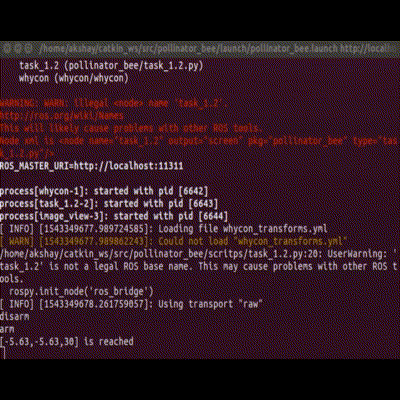
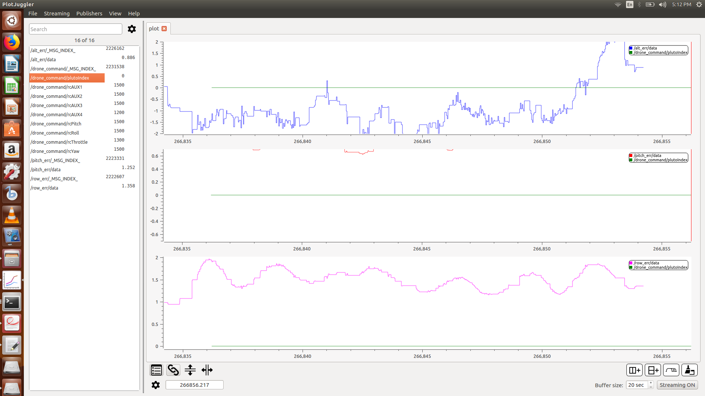
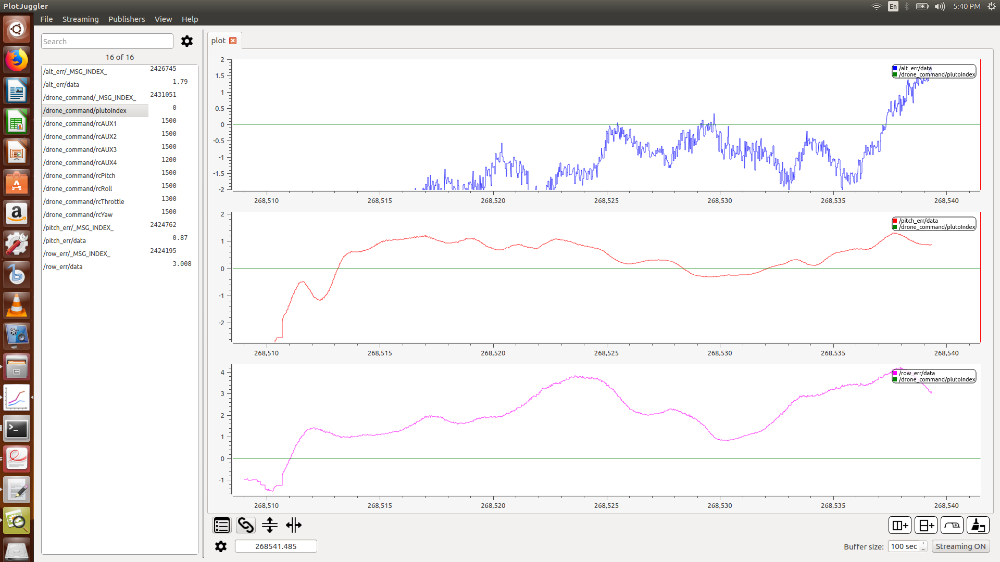

# Pollinator-Bee
Localization of Quadcopters using Whycon markers.

### Video Demonstration
https://youtu.be/zN5eXg5qNxU

### Results Snapshots

Testing on VREP simulator

  
  
    
  

 

Tuning using plotuggler

  
  
  

 

Real-Time testing

  
  

 

